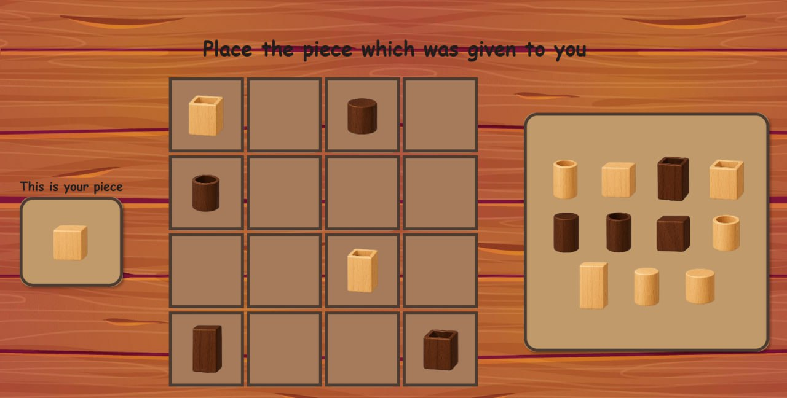

# 🎮 JavaFX Quarto Game

A sleek desktop version of **Quarto**, the 4x4 strategy game where each of the 16 unique pieces has 4 distinct attributes. Outthink your opponent by giving them the piece that leads to their downfall.

---

## 🧠 What is Quarto?

Quarto is a two-player abstract strategy game. Players take turns selecting a piece *for their opponent* to place on the board. The first to line up four pieces that share a common attribute—color, shape, height, or fill—wins.

---

## ✨ Features

- 🎮 Full game logic & rules implemented  
- 👤 Local two-player mode  
- 🎨 Clean JavaFX interface with animations  
- 🔍 Highlighted legal moves and selected pieces  
- 💾 Save/load game support  
- 🧪 Tested core logic (JUnit)

---

## 🚀 Getting Started

### Requirements

- Java 17+
- Gradle or Maven
